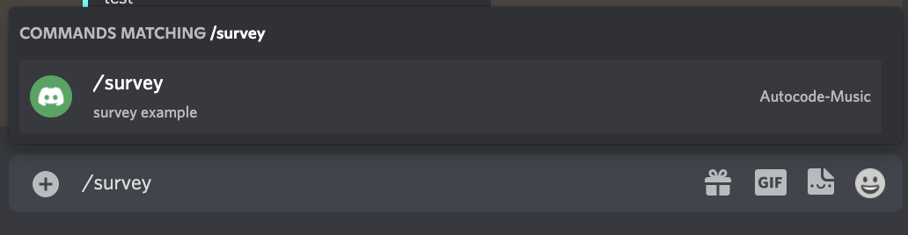

# How to Build a Survey System for Discord with Modals

This app allows you to collect surveys via a slash command and modals. Modals are interactive forms that you can add to your Discord bot to create fun, dynamic and enriching experiences for your users.
## Step-by-Step Guide
If you would like to create this app from scratch please follow our [step by step guide here](https://autocode.com/autocode/threads/how-to-build-a-survey-system-for-discord-with-modals-tutorial-17ac6771/) that explains how to set up every part of the code. 
 
 

## How it works

Any member in your Discord server can invoke the /survey command

A modal will appear with the questions
 
  
 
Once the person invoking the slash command submits the survey, their responses will be stored in a Google Sheet.
  

And they will receive a message confirming that their responses have been logged.

## Set up

### 1. Copy Google Sheet

We will need a Google Sheet to store our survey responses. For the purpose of this tutorial, copy my setup by clicking this [link](https://docs.google.com/spreadsheets/d/1fFALeuWMaC_Jc2nSh94pRUZh1MBCOdN7-xeNIzSlT7A/edit#gid=0y)
 

### 2. Link Accounts

- Link your Discord and Google Sheets accounts by clicking the red required button to the bottom left. 
- Disable pop up blockers and ad blocking extensions so that you don’t run into any unexpected issues.
- Follow the instructions in the popup window carefully as it will walk you through the following steps to create a Discord Application and link it to your Autocode account:
    - Create a Discord Application through the Discord Developer Portal
    - Retrieve Your Application Credentials
    - Add an OAuth2 Redirect
    - Add a Bot User and Bot Token
    
- Next link your Google Sheets account.

    - Select Link a New Resource
    - Choose an account to sign in with Google and Allow perms
    - Select the Sheet you want to link Copy of Discord Survey or whatever you named the file.

### 3. Register a Slash Command in Autocodes Slash Command Builder

- Link your Discord bot to the [Slash command builder](https://autocode.com/tools/discord/command-builder/)
- Input the slash command name `survey` and give it a description
- Select Save All

## Test it out!

Go into your server and type the slash command! Watch as your Google Sheets is updated with responses to each question in the modal!

## Troubleshooting

If you encounter any issues or if you need to add any functionality to this bot please don’t hesitate to reach out! I’d be happy to help! 

Ping me on our [Discord server](https://discord.com/invite/UjJAmdN3uZ). Username is janeth#2189 

